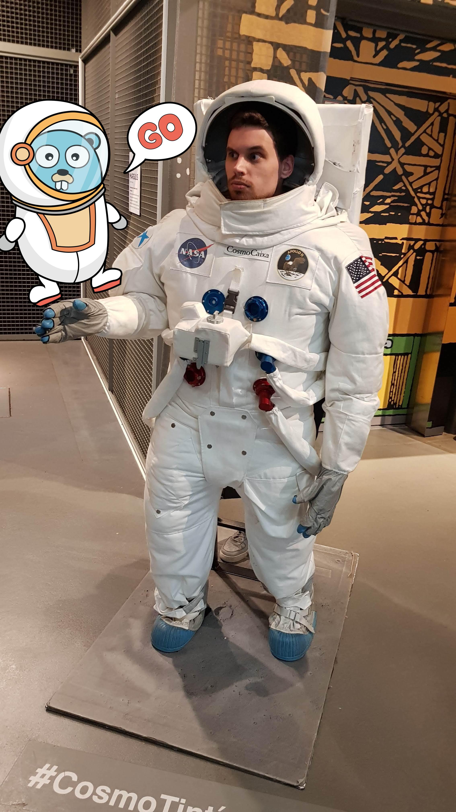

# gopherize-photo

This is just-for-fun experiment with pictures and OpenCV following the challenge by OMPRussia company 
at GopherCon Russia 2020.

## Requirements

`opencv` is required.

See https://gocv.io/getting-started/ for how to install.

## Usage

Build:

```shell script
go build -o gopherize-photo .
```

Gopherize the example:

```
./gopherize-photo \
  -classifier example-data/haarcascade_frontalface_default.xml \
  -photo example-data/me.jpg \
  -photo-detect-scale 1.1 \
  -photo-detect-min-size 200 \
  -photo-detect-max-size 800  \
  -photo-detect-min-neighbours 8 \
  -gopher example-data/gopher2.png \
  -gopher-x-coeff 0.95 \
  -gopher-y-coeff 0.3 \
  -out example-data/output.jpg
```

Result:

<details>
  <summary>Click me</summary>
  
  
  
</details>
